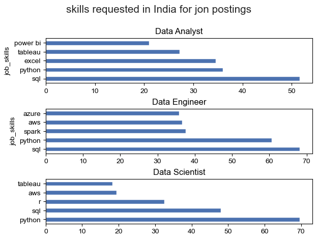
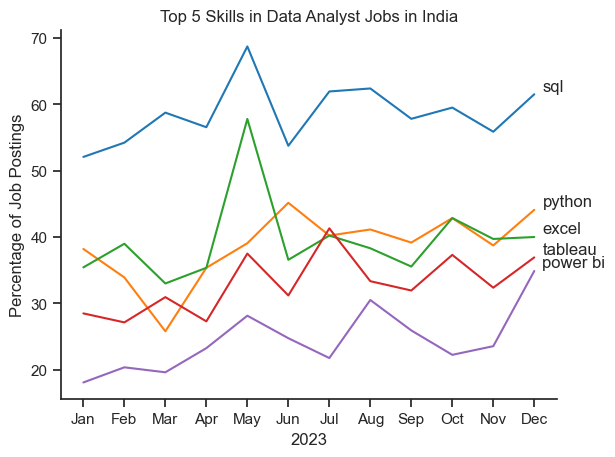
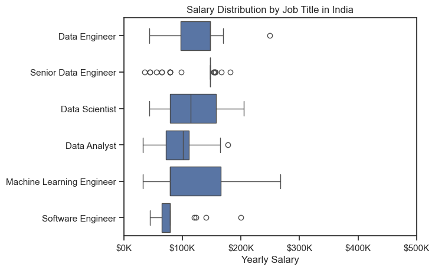
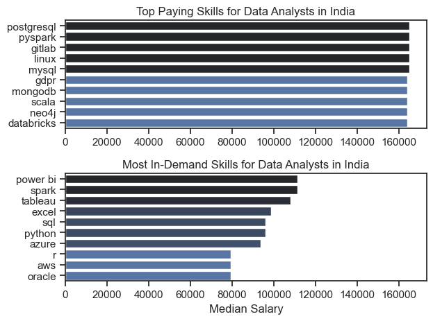

# The Analysis

##  1.What are the most demanded skills for the top 3 most popular data roles?

To find the most demanded skills for the top 3 most popular data roles. I filtered out thoes positions by which ones were the most popular, abd got the top 5 skills for these top 3 roles. Thid query highlights the most popular job titles and their top skills, showing which skills I should pay attention to depending on the role I'm targeting.

View my notebook with detailed steps here:
[2_Skill_Demand.ipynb](1_Python_Project.ipynb/2_Skill_Demand.ipynb)

### Visualization of data

```python

fig, ax = plt.subplots(len(job_titles), 1)
sns.set_theme(style='ticks')

for i, job_title in enumerate(job_titles):
   df_plot = df_skills_perc[df_skills_perc['job_title_short'] == job_title].head(5)
   df_plot.plot(kind='barh', x='job_skills', y='skill_percent', ax=ax[i], title=job_title, legend=False)
    
fig.suptitle('skills requested in India for jon postings', fontsize=15)
fig.tight_layout(h_pad=0.5)
plt.show()

```

### Result



### Insights

- SQL is the most requested skill for data analyst and data engineer, with it is in more than half pf the job postings for both the roles. For data scientist python is the most requessted ons, appering in 69% of the job postings.

- Python is a versatile skill, highly demanded across all three roles, but most prominently for data scientist and data engineer.


# The Analysis

## 2. How are in-demand skills trending for Data Analysts?

### Visualize data

```python
df_plot=df_DA_IND_percent.iloc[:, :5]

sns.lineplot(data=df_plot, dashes=False, palette='tab10')
sns.set_theme(style='ticks')
sns.despine()

plt.title('Top 5 Skills in Data Analyst Jobs in India')
plt.xlabel('2023')
plt.ylabel('Percentage of Job Postings')
plt.legend().remove()
for i in range(5):
    plt.text(11.2, df_plot.iloc[-1, i] + 0.5, df_plot.columns[i])

```



## Insights:
- SQL remains the most consisstently demanded skill
throughout the year

- Exceel experienced a significant increase in demand during May, surpassing both Python and Tableau.

- Python, Tableau and Power BI dhows stable demand throughout the year with some fluctuations but remains essential skills for Data Analysts.

# The Analysis

## 3. How well do jobs and skills pay for Data Analysts and highest paid and most demanded skills for Data Analysts?

### Visualize Data

```python
sns.boxplot(data=df_IND_top6, x='salary_year_avg', y='job_title_short',order=job_order)
sns.set_theme(style='ticks')

plt.title('Salary Distribution by Job Title in India')
plt.xlabel('Yearly Salary')
plt.ylabel('')
plt.xlim(0, 500000)
ticks_x= plt.FuncFormatter(lambda y, pos: f'${int(y/1000)}K')
plt.gca().xaxis.set_major_formatter(ticks_x)
plt.show()

```

#### Results



### Insights

- There is a significance variation in salary ranges across the different jobs. Data Engineer position tends to have the highest salary.

- The machine learning engineer and data scientist have a wide range of jobs position with consistenc salary, with few outliers.


### Visulize Data

```python
fig, ax = plt.subplots(2, 1)

sns.set_theme(style='ticks')
# top 10 highest paying skills for Data Analysts in India
sns.barplot(data=df_DA_top_pay, x='median', y=df_DA_top_pay.index,hue='median', ax=ax[0], palette='dark:b_r')
ax[0].set_title('Top Paying Skills for Data Analysts in India')
ax[0].set_xlabel('')
ax[0].set_ylabel('')
ax[0].legend_.remove()


# top 10 most in-demand skills for Data Analysts in India
sns.barplot(data=df_DA_skills, x='median', y=df_DA_skills.index, hue='median', ax=ax[1], palette='dark:b_r')
ax[1].set_title('Most In-Demand Skills for Data Analysts in India')
ax[1].set_ylabel('')
ax[1].set_xlabel('Median Salary')
ax[1].legend_.remove()
ax[1].set_xlim(ax[0].get_xlim())

plt.tight_layout()
plt.show()

```



### Insights:

- The top graph shows specialized technical skills like 'postgresql', 'pyspark',and 'gitlab' are associated with higher salarie.

- The bottom graph highlights that foundational skills like 'poer bi', 'spark', and 'tableau' are most in-demand.

- There is a clear distinction between the skills between the higheat paid jobs and those that are most in- demand. Data Analysts aiming to maximize their career potential should consider developing a diverse skill set that includes both high-paying specialized skills and widely demanded skills.
